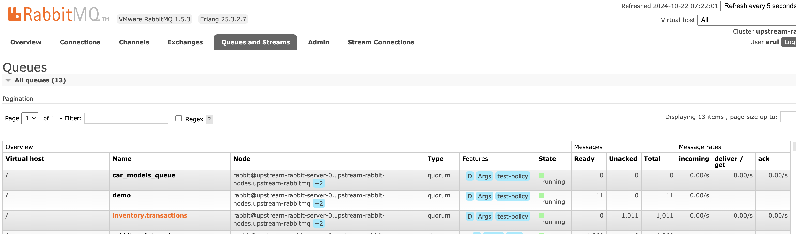
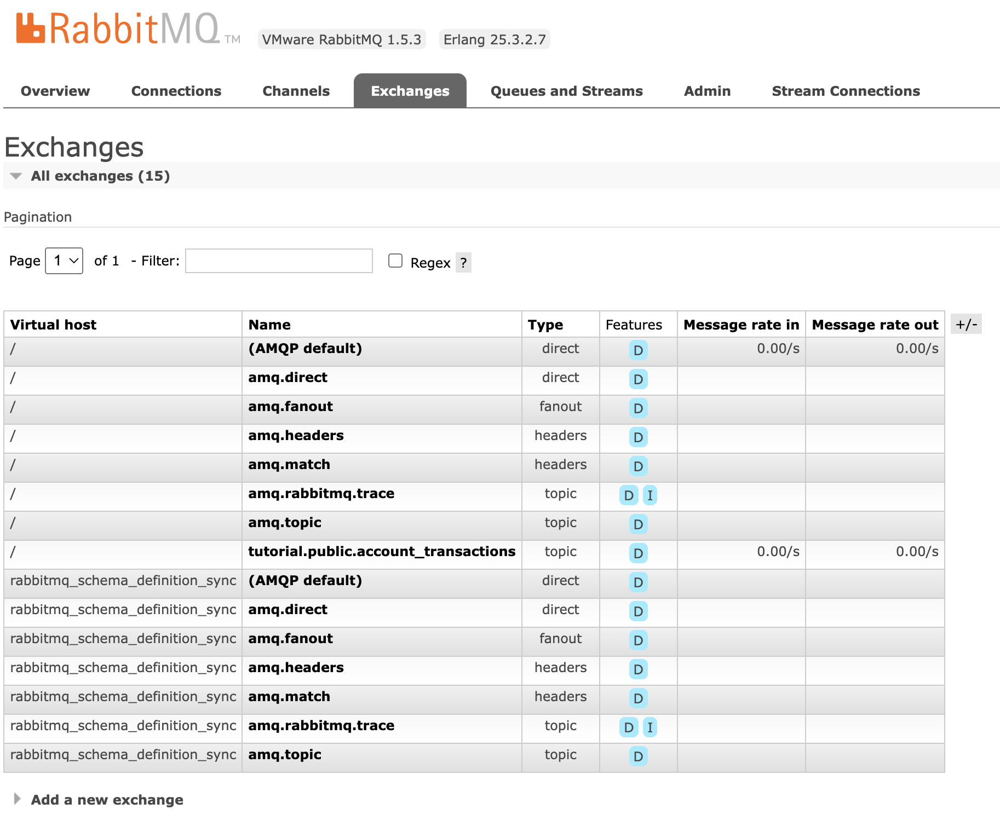
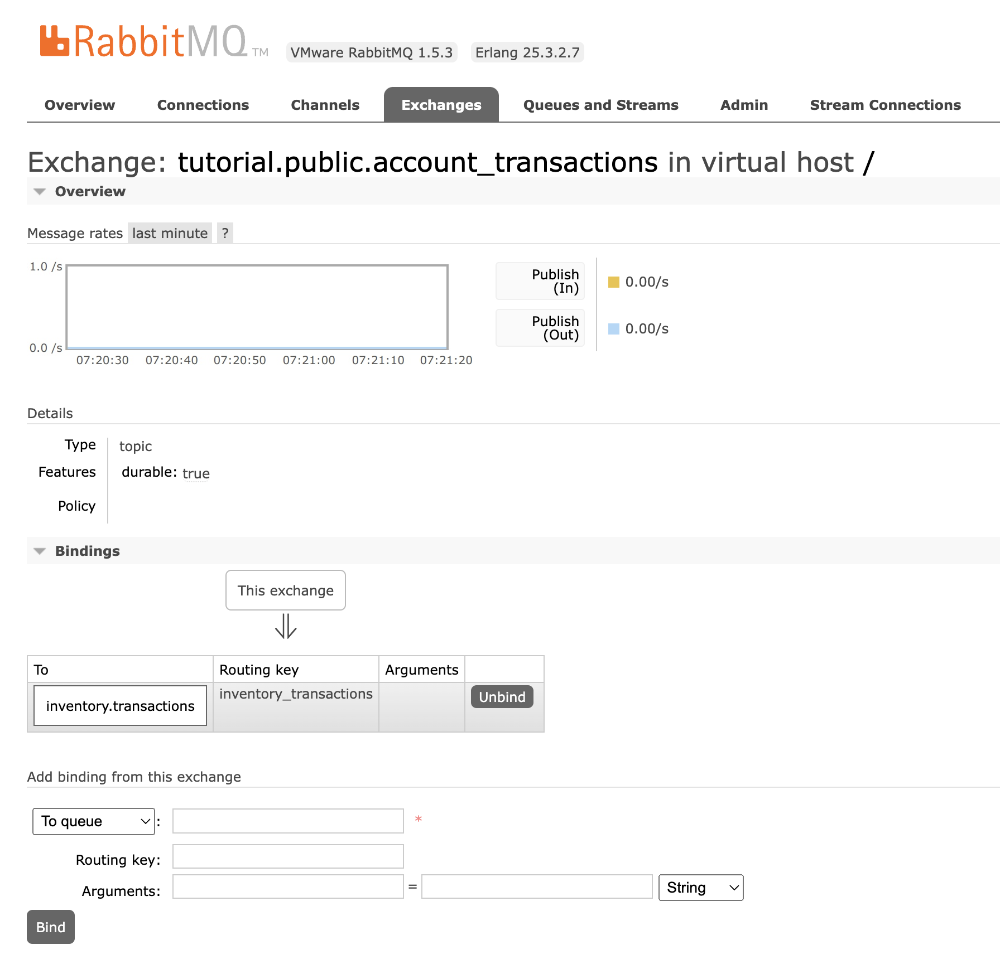

# cdc-debezium-postgres-rabbitmq

<p align="center">

</p>

> This is a poc repo that demonstrating and implementing the Change Data Capture (CDC) concept using Debezium and PostgreSQL. This project focuses on the monitoring and capturing of row-level changes in PostgreSQL tables. Leveraging Debezium, we enable the distribution of these changes, allowing applications to detect and react to data modifications in real-time.

## Requirments:
> Kubernetes Cluster 
> RabbitMQ OSS or VMware RabbitMQ
> Postgress OSS or VMware Postgres
> Docker (for local)


## How to run on K8s

> Create docker containers for Debezium server and demo view and loader apps and you can leverage the deployment yaml in k8s folders
Note: The demo apps just act as viewer to see the CDC transactions.

> Create table transacations

```sql
CREATE TABLE public.account_transactions (
    transaction_id SERIAL PRIMARY KEY,
    account_number BIGINT NOT NULL,
    transaction_date DATE NOT NULL,
    transaction_type VARCHAR(20) NOT NULL, -- e.g., 'deposit', 'withdrawal', 'transfer'
    amount DECIMAL(10, 2) NOT NULL,
    balance DECIMAL(10, 2) NOT NULL,
    description TEXT,
    created_at TIMESTAMP DEFAULT CURRENT_TIMESTAMP
);

```


> From rabbitMQ GUI create
  - new RabbitMQ Topic Exchange called `tutorial.public.account_transaction`
  - new RabbitMQ Queue called `inventory_transactions` and bind it with the exchange using routing key `inventory_trasactions`

  <p align="center">
  
  </p>

  <p align="center">
  
  </p>

  <p align="center">
  
  </p>

> make sure that debezium-server is up and running.


> Inserting new data to transactions table. you can use [tableplus](https://tableplus.com/) or run this query

```sql
INSERT INTO public.account_transactions (account_number, transaction_date, transaction_type, amount, balance, description)
SELECT
    FLOOR(RANDOM() * (9999999999 - 1000000000) + 1000000000) AS account_number,
    CURRENT_DATE - INTERVAL '1 day' * FLOOR(RANDOM() * 365) AS transaction_date,
    CASE WHEN RANDOM() < 0.5 THEN 'deposit' ELSE 'withdrawal' END AS transaction_type,
    FLOOR(RANDOM() * 10000) / 100.00 AS amount,
    FLOOR(RANDOM() * 100000) / 100.00 AS balance,
    'Sample Transaction'
FROM generate_series(1, 10) AS i;
```

> You should see data in your RabbitMQ queue


## References
- [Streaming CDC Events using RabbitMQ and Debezium](https://medium.com/greenplum-data-clinics/streaming-cdc-events-from-any-database-to-greenplum-data-warehouse-using-rabbitmq-and-debezium-5eccc678dfae)


<p align="center">

</p>
